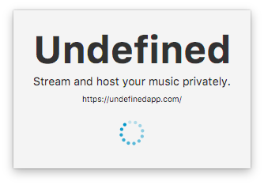
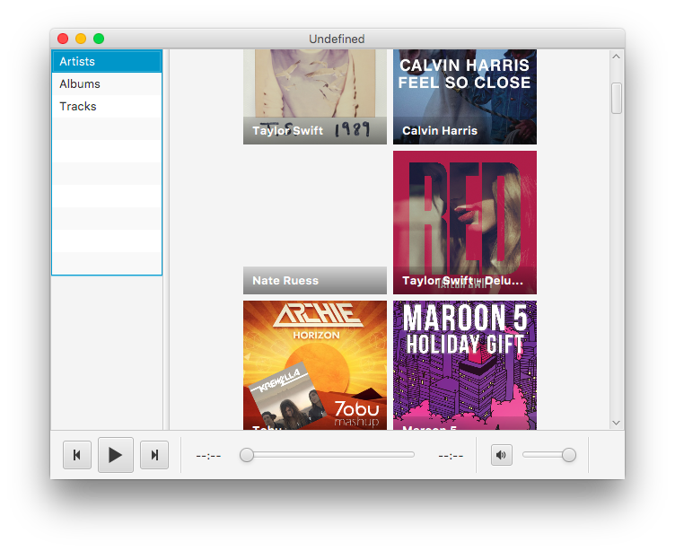
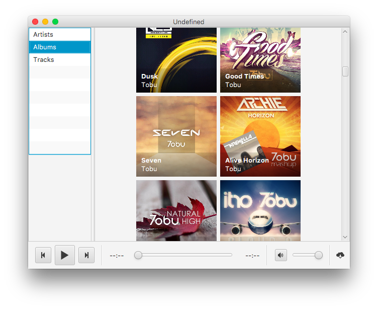
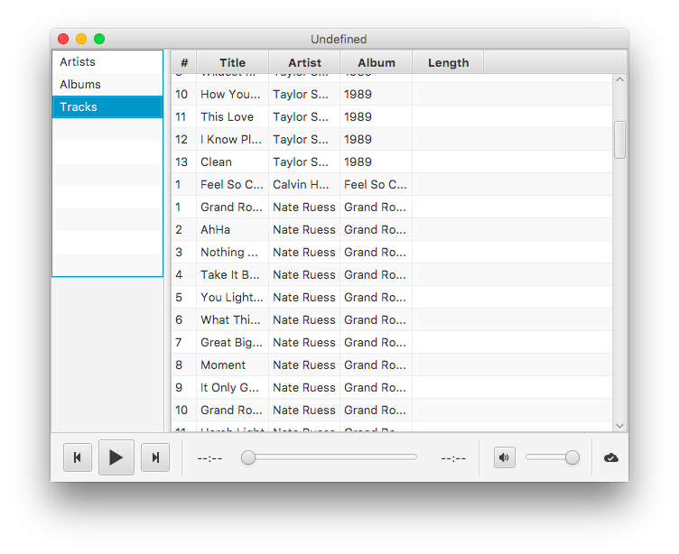
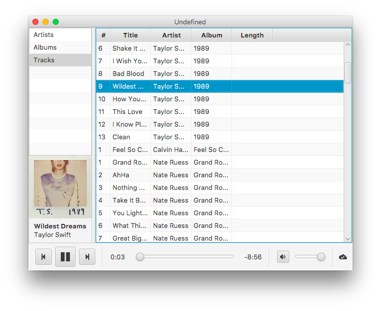
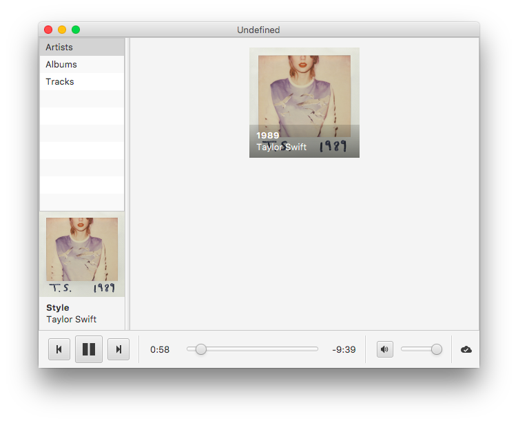
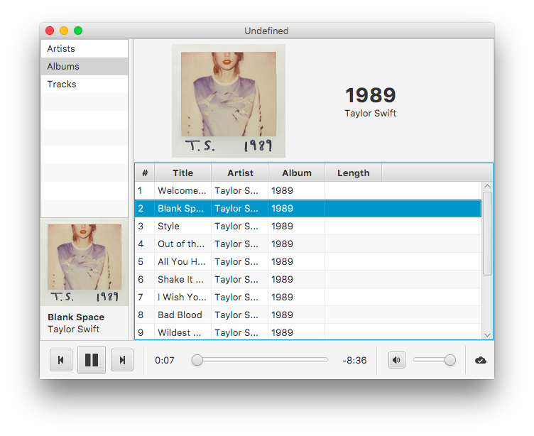

# Undefined

A self-hosted music streaming service, with a client written in JavaFX for a graded CS project.

Oh and here's the [report](REPORT.md).

## Features

* Host your music on you own [server](https://github.com/ambrosechua/Undefined-server). (incomplete)
* Stream via HTTP from anywhere around the world. (done)
* Albums, Artists, Songs. (done)
* Easy to use nw.js server interface. (incomplete)

## Obvious Bugs 

* Can't autoplay next track. (An issue with Java's `MediaPlayer` being unable to trigger onEndOfMedia or the final duration)
* Glitches when seeking beyond buffer.
* Can't return to list of artists or albums when one is chosen. 
* Occasional lagspikes probably due to JVM GC.
* Extremely confusing behaviour when stopped playing. 
* `MediaPlayer` provides inaccurate lengths. (Causes problems when seeking)
* High memory usage.

## Future features (Probably not goint to be implemented anytime soon in the next millennium)

* Fix syncing
* Offline playback
* Improved UX
* Playlisting

## Screenshots

## Usage

### Get server

#### Option 1: Devs

1. Get [node.js](http://nodejs.org)
2. `git clone https://github.com/ambrosechua/Undefined-server.git`
3. `cd Undefined-server`
4. `npm install`
5. `npm start`
6. Dump music according to structure in Wiki.

#### Option 2: Users

[Download](https://github.com/ambrosechua/Undefined-server/releases) the nw.js application, unzip it, run it.

### Get client

Download a prepackaged jar in [releases](https://github.com/ambrosechua/Undefined/releases). Run and enjoy!

### LICENSING

Someday I'll put this back under WTFPL. 